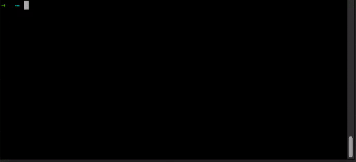

# Minishell



The purpose of Minishell is to create a shell.

What's a shell? Basically, in an operating system there are two elements:

- The kernel: which performs the fundamental functions of the operating system, such as managing memory, processes, files...

- The shell: the interface between the user and the kernel, enabling the user to communicate with the operating system with a command language. The user can enter commands in the terminal. Thanks to the command-line interpreter (such as bash or zsh, which are shells), the commands entered are executed.
 --> Let's create our own little shell.

## Roadmap

Mandatory

- Can only use C 
- Must respect the school imposed coding style
- No memory leaks
- Implement a series of builtins: echo, cd, setenv, unsetenv, env, exit
- Manage the errors without using errno, by displaying a message adapted to the error output
- Can only use some standard library functions(check the subject to saw them)
- Must have a Makefile to build the program
- The binary file must be named minishell
- Handle signals (CTRL + C, CTRL + D)
- redirection ('>', '<' , '>>', '<<'), pipes ('|') and $
## Installation

**Building the program :**
```bash
  git clone https://github.com/Zheylkoss/Minishell.git
  cd Minishell && make
```

**Running the program :**
```bash
    ./Minishell
```
